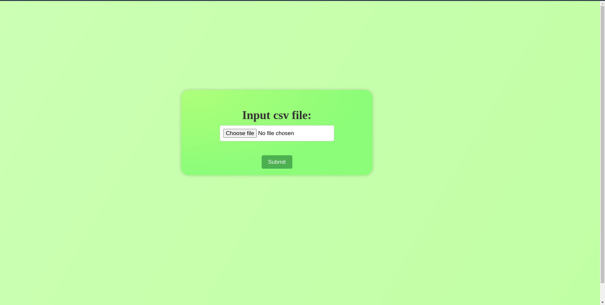

# Django webapp to easily work with CSV files

1.<b>Setup</b>
```
git clone https://github.com/Kunal-Shaw-097/CSV_summary
```
```
cd CSV_summary
```
```
pip install -r requirements.txt
```

2.<b>Start the Webapp</b>
```
python manage.py runserver
```

3.<b>Visit localhost:8000 on your browser.<b>

##





